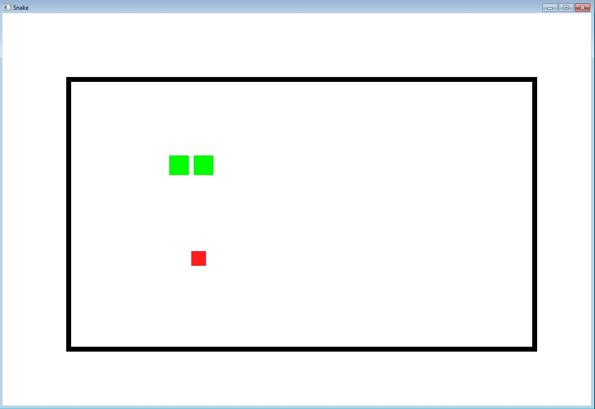
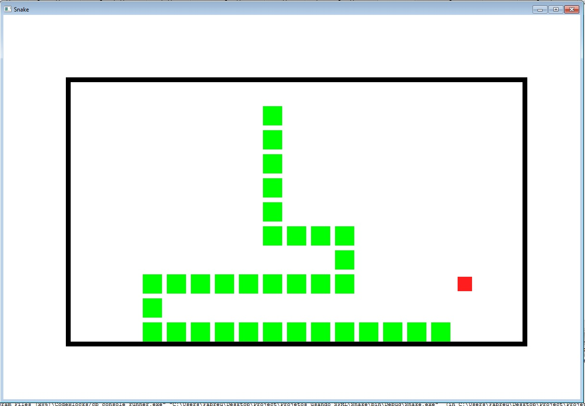

# Snake
	
Imitação do famosos joguinho da cobrinha.

## Objetivo:
Comer o máximo de comida(blocos vermelhos na tela) sem colidir com as paredes e com seu próprio corpo.
	
## Padronizado:

- tamanho dos blocos(mudar por meio da macro BLOCKSIZE no arquivo "Game.h")
- capacidade de blocos no mapa(mudar pelas macros BLOCKX e BLOCKY no arquivo "Game.h")
- Espaçamento entre os blocos(mudar pela macro SPACING no arquivo "Game.h")
- Tamanho inicial da Cobra(...)
- Tempo da cobra movimenta um bloco(mudar pela macro SLEEP no arquivo Snake.h)

## Atualizações Futuras:

- Mostrar a Pontuação durante o jogo;
- Criação de menus de pause, menu de records, menu inicial;
- Resolver o problema da posição inicial da primeira comida e encontra outro problemas;
- Vereficar se fica melhor Agregando as classes Snake e Food em Field em vez da classe Game(fazer uma análise dos relacionamentos das classes usando UML);
